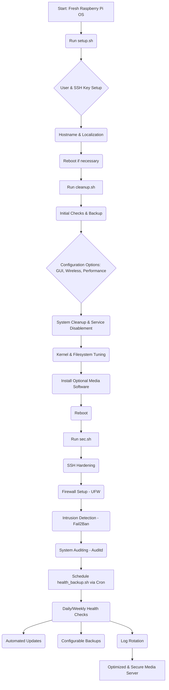

<!--
  Generated by AI-Powered README Generator
  Repository: https://github.com/WomB0ComB0/rpi-4
  Generated: 2025-10-05T01:10:37.434Z
  Format: md
  Style: comprehensive
-->

# 🚀 Raspberry Pi Media Server Optimizer & Hardener (`rpi-4`)

<p align="center">
  
  
  
  
  
  
</p>

A collection of robust Bash scripts designed to transform your Raspberry Pi into a high-performance, secure, and optimized media server.

---

## 🗺️ Table of Contents

- [🚀 Raspberry Pi Media Server Optimizer & Hardener (`rpi-4`)](#-raspberry-pi-media-server-optimizer--hardener-rpi-4)
  - [🗺️ Table of Contents](#-table-of-contents)
  - [🌟 Overview & Purpose](#-overview--purpose)
    - [What it Does](#what-it-does)
    - [Why it Matters](#why-it-matters)
    - [Target Audience](#target-audience)
  - [✨ Feature Highlights](#-feature-highlights)
    - [System Initialization (`setup.sh`)](#system-initialization-setupsh)
    - [Performance & Resource Optimization (`cleanup.sh`)](#performance--resource-optimization-cleanupsh)
    - [Security Hardening (`sec.sh`)](#security-hardening-secsh)
    - [Health Monitoring & Maintenance (`health_backup.sh`)](#health-monitoring--maintenance-health_backupsh)
  - [🏛️ Architecture & Design](#️-architecture--design)
    - [Component Diagram](#component-diagram)
    - [Technology Stack](#technology-stack)
  - [⚡ Getting Started](#-getting-started)
    - [Prerequisites](#prerequisites)
    - [Installation](#installation)
    - [Configuration](#configuration)
    - [Running the Scripts](#running-the-scripts)
      - [Development](#development)
      - [Production](#production)
  - [🛠️ Usage & Workflows](#️-usage--workflows)
    - [Initial Setup Workflow (Recommended)](#initial-setup-workflow-recommended)
      - [Step 1: Initial System Setup (`setup.sh`)](#step-1-initial-system-setup-setupsh)
      - [Step 2: Optimize & Clean (`cleanup.sh`)](#step-2-optimize--clean-cleanupsh)
      - [Step 3: Harden Security (`sec.sh`)](#step-3-harden-security-secsh)
      - [Step 4: Schedule Health & Backup (`health_backup.sh`)](#step-4-schedule-health--backup-health_backupsh)
    - [Example: Running `cleanup.sh` Interactivenly](#example-running-cleanupsh-interactivenly)
    - [Example: Scheduling `health_backup.sh` with Cron](#example-scheduling-health_backupsh-with-cron)
  - [⚠️ Limitations, Known Issues & Future Roadmap](#️-limitations-known-issues--future-roadmap)
    - [Current Limitations](#current-limitations)
    - [Known Issues](#known-issues)
    - [Future Roadmap & Enhancements](#future-roadmap--enhancements)
    - [Request a Feature](#request-a-feature)
  - [🤝 Contributing & Development Guidelines](#-contributing--development-guidelines)
    - [How to Contribute](#how-to-contribute)
    - [Branching & Pull Request Guidelines](#branching--pull-request-guidelines)
    - [Code Style & Linting](#code-style--linting)
    - [Testing](#testing)
    - [Development Setup](#development-setup)
  - [📄 License, Credits & Contact](#-license-credits--contact)
    - [License](#license)
    - [Acknowledgments](#acknowledgments)
    - [Contact](#contact)
  - [📚 Appendix](#-appendix)
    - [Changelog](#changelog)
    - [FAQ (Frequently Asked Questions)](#faq-frequently-asked-questions)
    - [Troubleshooting Guide](#troubleshooting-guide)
    - [Additional Resources](#additional-resources)

---

## 🌟 Overview & Purpose

The `rpi-4` project provides a suite of Bash scripts tailored for the Raspberry Pi 4 (though largely compatible with other Raspberry Pi models running Raspberry Pi OS/Raspbian) to enhance its performance, security, and stability, particularly for media server applications.

### What it Does

This application transforms a standard Raspberry Pi OS installation into a streamlined, headless media server platform by:

*   **Automating initial setup:** Handles common first-time configurations like user creation, SSH key setup, hostname, and localization.
*   **Optimizing system resources:** Removes unnecessary packages (like GUI components), disables unused services (e.g., Bluetooth, Wi-Fi), and tunes kernel parameters.
*   **Enhancing security:** Implements robust SSH hardening, configures a firewall, sets up intrusion detection with `fail2ban`, and establishes system auditing.
*   **Ensuring system health and data integrity:** Provides scripts for regular system health checks, package updates, and configurable backups of critical system files.

### Why it Matters

Running a media server on a Raspberry Pi is a popular and cost-effective solution. However, a default Raspberry Pi OS installation is not optimized for this purpose. It often includes desktop environments and services that consume valuable CPU, RAM, and disk I/O, hindering media streaming or file serving performance. Furthermore, security out-of-the-box can be insufficient for an always-on network device.

`rpi-4` addresses these issues by:
*   **Maximizing performance:** Freeing up resources to dedicate to media server tasks.
*   **Improving stability:** Reducing background processes and potential conflicts.
*   **Strengthening security:** Protecting your device from common network threats.
*   **Simplifying maintenance:** Automating routine tasks and providing health insights.

### Target Audience

*   **Raspberry Pi enthusiasts** looking to build a dedicated media server (e.g., using Plex, Jellyfin, Kodi, DLNA).
*   **DIY home lab users** who want to optimize their embedded systems for specific headless tasks.
*   **Anyone seeking to harden and streamline their Raspberry Pi** installation for improved performance and security.
*   **System administrators** looking for a repeatable way to deploy optimized Pi units.

[⬆️ Back to Top](#-table-of-contents)

---

## ✨ Feature Highlights

This project offers a comprehensive set of features, categorized by their primary script:

### System Initialization (`setup.sh`)
*   ✅ **Interactive User Creation:** Securely create new administrative users with `sudo` privileges.
*   ✅ **SSH Key-based Authentication:** Facilitates setting up SSH public key authentication for enhanced security.
*   ✅ **Hostname Configuration:** Easily set a unique hostname for your Raspberry Pi.
*   ✅ **Timezone & Locale Setup:** Ensures correct time synchronization and localization.
*   ✅ **Password-less Sudo Setup:** Configures password-less `sudo` for specified users, streamlining automation.

### Performance & Resource Optimization (`cleanup.sh`)
*   🚀 **System Cleanup:** Removes unnecessary packages, old kernel headers, and frees up disk space.
*   🚀 **Service Disablement:**
    *   Optional removal of **GUI/Desktop packages** for headless operation.
    *   Optional disabling of **Wireless services (WiFi & Bluetooth)** to save resources and power.
*   🚀 **Kernel & Filesystem Optimization:**
    *   Tuning `sysctl.conf` for better network performance and memory management.
    *   Adjusting `boot/config.txt` parameters (e.g., GPU memory split) for media server roles.
*   🚀 **Automatic Security Updates:** Configurable setup for unattended security upgrades.
*   🚀 **Media Server Software Installation (Optional):** Pre-configured option to install popular media server software packages (e.g., `minidlna`, `transmission-daemon`).
*   🔍 **Detailed System Information:** Gathers and displays crucial Raspberry Pi hardware and OS details before changes.
*   ⚠️ **Critical File Backup:** Automatically backs up essential configuration files before applying changes, ensuring easy rollback.

### Security Hardening (`sec.sh`)
*   🔒 **SSH Configuration Hardening:**
    *   Disables root login via SSH.
    *   Disables password authentication (if SSH keys are set up).
    *   Restricts SSH access to specific users.
    *   Limits maximum authentication retries.
*   🔒 **Firewall Setup (UFW):** Installs and configures UFW (Uncomplicated Firewall) to allow only necessary inbound connections (e.g., SSH, HTTP/S for media servers).
*   🔒 **Intrusion Detection (`fail2ban`):** Installs and configures `fail2ban` to protect against brute-force attacks on SSH and other services.
*   🔒 **System Auditing (`auditd`):** Sets up `auditd` to log security-relevant information, aiding in incident response.
*   🔒 **Regular Security Updates:** Ensures your system stays patched against known vulnerabilities.

### Health Monitoring & Maintenance (`health_backup.sh`)
*   ❤️‍🩹 **Comprehensive Health Checks:**
    *   Monitors CPU temperature, ensuring optimal operating conditions.
    *   Checks disk usage for all mounted filesystems.
    *   Displays memory usage (RAM and swap).
*   ❤️‍🩹 **Automatic Package Updates:** Performs `apt update` and `apt upgrade` to keep installed software current.
*   ❤️‍🩹 **Configurable System Backup:** Creates tar archives of specified directories, optionally encrypting them.
*   ❤️‍🩹 **Log Rotation:** Manages log file sizes to prevent disk exhaustion.
*   ❤️‍🩹 **Scheduled Execution:** Designed to be run periodically via `cron` for continuous monitoring and maintenance.

[⬆️ Back to Top](#-table-of-contents)

---

## 🏛️ Architecture & Design

The `rpi-4` project consists of independent, yet interconnected, Bash scripts. Each script focuses on a specific aspect of system management, promoting modularity and reusability. They are designed to be run sequentially for a full system optimization, but can also be executed individually as needed.

### Component Diagram

The following Mermaid diagram illustrates the recommended execution flow and interaction between the main scripts:



**Explanation of Components:**

*   **`setup.sh`**: Handles the very first steps on a fresh system, making it ready for further optimizations and secure remote access. It's interactive for user-specific settings.
*   **`cleanup.sh`**: The core optimization script. It performs system-wide changes to reduce bloat, free up resources, and apply performance-oriented configurations. It includes a critical backup step and interactive prompts.
*   **`sec.sh`**: Focuses purely on security. It configures essential defenses to protect the Raspberry Pi from external threats.
*   **`health_backup.sh`**: A utility script designed for recurring tasks. It monitors system health, keeps packages updated, and performs backups, typically scheduled via `cron`.

### Technology Stack

*   **Operating System**: Primarily designed for **Raspberry Pi OS (Debian-based)**.
*   **Scripting Language**: **Bash** shell scripting.
*   **Core Utilities**: Standard Linux commands and utilities (e.g., `apt`, `systemctl`, `sed`, `awk`, `grep`, `cp`, `mv`, `tar`, `cron`, `ufw`, `fail2ban`, `auditd`, `sysctl`).
*   **Diagramming**: **Mermaid** for generating descriptive architecture diagrams.

[⬆️ Back to Top](#-table-of-contents)

---

## ⚡ Getting Started

This section guides you through setting up and running the `rpi-4` scripts on your Raspberry Pi.

### Prerequisites

Before you begin, ensure you have the following:

*   **Raspberry Pi 4 (or compatible)**: While designed for Pi 4, most scripts should work on Pi 3B+, 3A+, 3B, and newer models running **Raspberry Pi OS Lite (64-bit or 32-bit)**.
*   **Fresh Raspberry Pi OS Installation**: It's highly recommended to start with a fresh install of Raspberry Pi OS (formerly Raspbian) to avoid conflicts with existing configurations. The **Lite** version is preferred as it has no desktop environment.
*   **SSH Access**: You should be able to connect to your Raspberry Pi via SSH. The default username is `pi` and password `raspberry` (change this immediately!).
*   **Internet Connection**: Your Raspberry Pi needs an active internet connection to download packages and updates.
*   **`sudo` privileges**: All scripts require `root` or `sudo` privileges to execute.

> [!WARNING]
> These scripts make significant changes to your system. **Always back up critical data** before running them, especially on a production system. A fresh OS installation is recommended.

### Installation

1.  **Connect via SSH**:
    ```bash
    ssh pi@your_rpi_ip_address
    ```

2.  **Update your system (recommended first step on any new install)**:
    ```bash
    sudo apt update && sudo apt full-upgrade -y
    sudo reboot # Reboot if kernel or critical system components were updated
    ```

3.  **Clone the repository**:
    ```bash
    cd ~
    git clone https://github.com/WomB0ComB0/rpi-4.git
    cd rpi-4
    ```

4.  **Make scripts executable**:
    ```bash
    chmod +x *.sh
    ```

### Configuration

Some scripts (like `cleanup.sh` and `health_backup.sh`) have configurable variables at the top of the script files. You can edit these directly to suit your needs before running them.

For `cleanup.sh`:
*   `INSTALL_MEDIA_SERVER_SOFTWARE`: Set to `true` to enable automatic installation of specified media server packages.
*   `MEDIA_SERVER_PACKAGES`: Uncomment or add packages you wish to install.
    ```bash
    # Example snippet from cleanup.sh
    INSTALL_MEDIA_SERVER_SOFTWARE=false # Set to true and edit the list below to auto-install

    MEDIA_SERVER_PACKAGES=(
        #"minidlna"
        #"transmission-daemon"
        #"samba" # If you need network shares (SMB/CIFS)
        # "plexmediaserver" # Often requires manual download/install
        # "jellyfin" # Often requires manual setup of repositories
    )
    ```

For `health_backup.sh`:
*   `BACKUP_PATHS`: Specify the directories you want to back up.
*   `BACKUP_DEST`: Define the destination for your backup archives.
*   `MAX_BACKUPS`: Control the number of old backups to retain.
*   `ENCRYPT_BACKUP`: Set to `true` and provide a `GPG_RECIPIENT_EMAIL` for encrypted backups.

> [!TIP]
> Always review the script content, especially the configuration sections, to understand what changes will be made and to customize it for your specific setup.

### Running the Scripts

The scripts are designed to be run as `root` (e.g., using `sudo`).

#### Development

For testing or development, you can run individual scripts directly.

```bash
sudo ./cleanup.sh
sudo ./sec.sh
# etc.
```

#### Production

For a full system setup, follow the recommended workflow outlined in the [Usage & Workflows](#️-usage--workflows) section. `health_backup.sh` is typically scheduled as a cron job for production environments.

[⬆️ Back to Top](#-table-of-contents)

---

## 🛠️ Usage & Workflows

This section provides a step-by-step guide on how to use the `rpi-4` scripts to achieve a fully optimized and secure Raspberry Pi media server.

> [!IMPORTANT]
> Always run these scripts from within the `rpi-4` directory after cloning the repository.
> `cd ~/rpi-4`

### Initial Setup Workflow (Recommended)

This workflow assumes a fresh installation of Raspberry Pi OS Lite and guides you through the process of setting up your system from scratch.

#### Step 1: Initial System Setup (`setup.sh`)

This script handles basic system configurations and sets up a secure way to access your Pi.

```bash
sudo ./setup.sh
```

> [!NOTE]
> This script is highly interactive. It will prompt you for:
> *   Creating a new user (recommended to replace `pi`).
> *   Setting up SSH keys for passwordless login.
> *   Configuring your hostname, timezone, and locale.
> *   Disabling the default `pi` user if a new admin user is created.
>
> Follow the prompts carefully. You might be asked to reboot after this step to apply hostname changes and new user configurations.

#### Step 2: Optimize & Clean (`cleanup.sh`)

After the initial setup and reboot (if required), run `cleanup.sh` to remove bloat and optimize for performance.

```bash
sudo ./cleanup.sh
```

> [!TIP]
> This script offers several interactive choices:
> *   **Remove GUI/Desktop packages:** Choose `y` if you're building a headless server.
> *   **Disable wireless services (WiFi/Bluetooth):** Choose `y` if your Pi is wired (Ethernet).
> *   **Optimize for maximum performance:** Choose `y` for media server tasks.
> *   **Set up automatic security updates:** Highly recommended to choose `y`.
>
> Before running, you can customize the `INSTALL_MEDIA_SERVER_SOFTWARE` and `MEDIA_SERVER_PACKAGES` variables at the top of the `cleanup.sh` file to automatically install applications like `minidlna` or `transmission-daemon`.
>
> **The script will ask for a final confirmation before proceeding.** Make sure to review the summary of changes. A reboot will be performed automatically after this script completes.

#### Step 3: Harden Security (`sec.sh`)

Once your system is optimized and has rebooted, apply security hardening measures.

```bash
sudo ./sec.sh
```

> [!WARNING]
> The `sec.sh` script will:
> *   **Disable root SSH login.**
> *   **Disable password authentication for SSH** if SSH keys are already configured via `setup.sh`. Ensure you have tested SSH key login before running this!
> *   **Configure UFW firewall.**
> *   **Install Fail2Ban.**
> *   **Install Auditd.**
>
> Make sure you understand these changes. If you haven't set up SSH keys, consider doing so with `setup.sh` first, or manually before running `sec.sh`.
> This script does not require a reboot immediately, but it's always good practice after significant security changes.

#### Step 4: Schedule Health & Backup (`health_backup.sh`)

Finally, set up continuous health monitoring and automated backups by scheduling `health_backup.sh` with `cron`.

First, edit the `health_backup.sh` script to configure your backup paths, destination, and encryption settings:

```bash
nano health_backup.sh
# Adjust BACKUP_PATHS, BACKUP_DEST, MAX_BACKUPS, ENCRYPT_BACKUP, GPG_RECIPIENT_EMAIL
```

Then, open your crontab for editing (as root):

```bash
sudo crontab -e
```

Add entries to run `health_backup.sh` periodically. For example, to run daily at 3:00 AM:

```cron
0 3 * * * /path/to/rpi-4/health_backup.sh >> /var/log/rpi_health_backup.log 2>&1
```
Replace `/path/to/rpi-4/` with the actual path where you cloned the repository (e.g., `/home/youruser/rpi-4/`).

> [!TIP]
> Consider running `health_backup.sh` manually once after configuration to ensure it works as expected:
> ```bash
> sudo ./health_backup.sh
> ```

### Example: Running `cleanup.sh` Interactivenly

Here's a snippet of what you might see when running `cleanup.sh`:

```bash
$ sudo ./cleanup.sh

=== INITIAL CHECKS ===
[INFO] Checking for existing apt locks...
[INFO] Successfully modified /etc/apt/apt.conf.d/50unattended-upgrades

=== SYSTEM INFORMATION ===
Raspberry Pi Model: Raspberry Pi 4 Model B Rev 1.4
Hardware Revision: Unknown
Architecture: aarch64
Total Memory: 3.7Gi
Operating System: Debian GNU/Linux 11 (bullseye)
Kernel Version: 5.10.103-v8+
[INFO] This script is designed for Raspberry Pi OS/Raspbian. It might work on other Debian-based systems, but proceed with caution.
Do you want to continue anyway? (y/n): y
[INFO] Proceeding with optimization...

=== BACKUP ===
[INFO] Creating backup directory at /root/system_backup_2024-07-29_10-30-00...
[INFO] Backing up key system configuration files...
[INFO] Creating list of currently installed packages...

=== CONFIGURATION OPTIONS ===
[INFO] Please answer the following questions to configure the optimization:
Do you want to remove GUI and desktop packages (recommended for headless media server)? (y/n): y
Do you want to disable wireless services (WiFi/Bluetooth) - select NO if you need WiFi? (y/n): y
Do you want to optimize for maximum performance (may use more power, potentially hotter)? (y/n): y
Do you want to set up automatic security updates? (y/n): y

=== REVIEW AND CONFIRM ===
Please review your selected options:
- Remove GUI: Yes
- Disable Wireless: Yes
- Optimize for Performance: Max Performance
- Automatic Security Updates: Enabled
[WARNING] Removing GUI packages is a significant change and requires command-line proficiency. You will need to interact via SSH or serial after reboot.
Do you want to proceed with these changes? This is your last chance to cancel. (y/n): y
[INFO] Proceeding with optimization...

... (script continues to execute changes) ...

[INFO] All tasks completed. System will now reboot to apply changes.
```

### Example: Scheduling `health_backup.sh` with Cron

```bash
# Example crontab entry for daily execution and log output
# M H D Mo W command
# 0 3 * * *      -> Run at 03:00 AM every day
# /home/adminuser/rpi-4/health_backup.sh -> Path to your script
# >> /var/log/rpi_health_backup.log 2>&1 -> Append output and errors to a log file

0 3 * * * /home/adminuser/rpi-4/health_backup.sh >> /var/log/rpi_health_backup.log 2>&1
```

> [!NOTE]
> Ensure the path to `health_backup.sh` is correct for your user's home directory (e.g., `/home/yourusername/rpi-4/health_backup.sh`).

[⬆️ Back to Top](#-table-of-contents)

---

## ⚠️ Limitations, Known Issues & Future Roadmap

This project is continuously evolving. Here's what to keep in mind and what's planned for the future.

### Current Limitations

*   **Raspberry Pi OS Specific**: While some scripts might work on other Debian-based systems, they are primarily tested and optimized for Raspberry Pi OS.
*   **Manual Media Server Installation**: For complex media server solutions like Plex Media Server or Jellyfin, the scripts currently only provide placeholders for `apt` installation. Full, automated setup often requires adding custom repositories or manual downloads/installations, which are not covered by these scripts.
*   **Backup Scope**: `health_backup.sh` performs backups of specified directories. It is not a full system image backup solution.
*   **Network Configuration**: Assumes DHCP for network setup; static IP configuration is not automated.
*   **Hardware Compatibility**: Primarily tested on Raspberry Pi 4. While likely compatible, behavior on other Pi models or different ARM boards might vary.
*   **Idempotency**: While efforts are made to ensure scripts are somewhat idempotent (running them multiple times won't break things), they are not fully designed for it. Running `cleanup.sh` or `sec.sh` multiple times *will* re-apply settings, which is generally fine, but could overwrite manual changes.

### Known Issues

*   **`rc.local` Deprecation**: The `cleanup.sh` script attempts to back up `/etc/rc.local`. Note that `rc.local` is deprecated in modern systemd-based Linux distributions and may not exist or be used. The script handles its absence gracefully with a warning.
*   **`/proc/cpuinfo` parsing**: Parsing `Model` and `Revision` from `/proc/cpuinfo` can sometimes return "Unknown" on newer OS versions or specific hardware revisions, though it's generally reliable.
*   **WiFi/Bluetooth Disablement**: Disabling wireless services (if chosen) is done via `dtoverlay` entries in `config.txt`. Ensure you have a wired connection if you select this option.

### Future Roadmap & Enhancements

*   **Enhanced Media Server Integration**: Develop more robust, opinionated installation functions for Plex, Jellyfin, and other popular media servers, including their specific repository setups.
*   **Advanced Monitoring**: Integrate with external monitoring tools (e.g., Prometheus/Grafana exporters) for more detailed long-term metrics.
*   **User-defined Configuration Files**: Implement a more robust configuration system (e.g., using YAML or TOML files) instead of direct script edits, allowing easier updates without merging conflicts.
*   **Interactive Menu System**: Explore a simple CLI menu (e.g., using `whiptail` or `dialog`) for a more guided user experience.
*   **Systemd Service Creation**: Automatically create `systemd` services for specific tasks where `cron` might be less ideal (e.g., ensuring a service is always running).
*   **Documentation Expansion**: Add more specific examples, troubleshooting steps, and a deeper dive into the changes made by each script.
*   **Version Control for Configs**: Option to back up modified config files to a git repository.

### Request a Feature

Have an idea for a new feature or an improvement? Please open an [issue on GitHub](https://github.com/WomB0ComB0/rpi-4/issues) with the `feature request` label.

[⬆️ Back to Top](#-table-of-contents)

---

## 🤝 Contributing & Development Guidelines

We welcome contributions! Whether it's bug reports, feature requests, or code contributions, your help is valuable.

### How to Contribute

1.  **Fork the Repository**: Start by forking the `rpi-4` repository to your GitHub account.
2.  **Clone Your Fork**:
    ```bash
    git clone https://github.com/YourUsername/rpi-4.git
    cd rpi-4
    ```
3.  **Create a New Branch**:
    ```bash
    git checkout -b feature/your-feature-name-or-bugfix/issue-number
    ```
    (e.g., `feature/plex-install` or `bugfix/cleanup-error-123`)
4.  **Make Your Changes**: Implement your feature or fix the bug.
5.  **Test Your Changes**: Ensure your changes work as expected and don't introduce new issues.
6.  **Commit Your Changes**:
    ```bash
    git commit -m "feat: Add new feature" # or "fix: Resolve bug XYZ"
    ```
    (Follow Conventional Commits guidelines if possible)
7.  **Push to Your Fork**:
    ```bash
    git push origin feature/your-feature-name-or-bugfix/issue-number
    ```
8.  **Open a Pull Request**: Go to the original `WomB0ComB0/rpi-4` repository on GitHub and open a new Pull Request. Provide a clear description of your changes.

### Branching & Pull Request Guidelines

*   **`main` branch**: This branch contains the latest stable and released code. All pull requests should target `main`.
*   **Feature Branches**: All development should happen in dedicated feature or bugfix branches.
*   **Descriptive PRs**: Provide a clear, concise description of your changes in the pull request. Include rationale, affected areas, and testing steps.
*   **One Feature/Fix per PR**: Keep pull requests focused on a single feature or bug fix to simplify reviews.

### Code Style & Linting

*   **Bash Best Practices**:
    *   Use `#!/bin/bash` shebang.
    *   Use `set -euo pipefail` for robust error handling.
    *   Quote variables to prevent word splitting and globbing.
    *   Use functions to organize code.
    *   Provide comments for complex logic.
*   **Formatting**: Maintain consistent indentation (e.g., 4 spaces or tabs, stick to one).
*   **Naming Conventions**: Use `snake_case` for variables and function names.

### Testing

*   **Local Testing**: Thoroughly test your changes on a Raspberry Pi (or a VM running Raspberry Pi OS) before submitting a PR.
*   **Backup**: Always ensure the backup functionality in `cleanup.sh` is working as expected.
*   **Interactive Prompts**: Verify that interactive prompts are clear and handle input correctly.

### Development Setup

To test changes, it's recommended to have:
*   A dedicated Raspberry Pi for testing.
*   A virtual machine running Raspberry Pi OS (e.g., using QEMU or VirtualBox) for rapid iteration.

[⬆️ Back to Top](#-table-of-contents)

---

## 📄 License, Credits & Contact

### License

This project is licensed under the **MIT License**.

```
MIT License

Copyright (c) 2024 WomB0ComB0

Permission is hereby granted, free of charge, to any person obtaining a copy
of this software and associated documentation files (the "Software"), to deal
in the Software without restriction, including without limitation the rights
to use, copy, modify, merge, publish, distribute, sublicense, and/or sell
copies of the Software, and to permit persons to whom the Software is
furnished to do so, subject to the following conditions:

The above copyright notice and this permission notice shall be included in all
copies or substantial portions of the Software.

THE SOFTWARE IS PROVIDED "AS IS", WITHOUT WARRANTY OF ANY KIND, EXPRESS OR
IMPLIED, INCLUDING BUT NOT LIMITED TO THE WARRANTIES OF MERCHANTABILITY,
FITNESS FOR A PARTICULAR PURPOSE AND NONINFRINGEMENT. IN NO EVENT SHALL THE
AUTHORS OR COPYRIGHT HOLDERS BE LIABLE FOR ANY CLAIM, DAMAGES OR OTHER
LIABILITY, WHETHER IN AN ACTION OF CONTRACT, TORT OR OTHERWISE, ARISING FROM,
OUT OF OR IN CONNECTION WITH THE SOFTWARE OR THE USE OR OTHER DEALINGS IN THE
SOFTWARE.
```

### Acknowledgments

*   This project leverages numerous standard Linux tools and utilities.
*   Thanks to the Raspberry Pi community for continuous innovation and inspiration.
*   Special thanks to the developers of `UFW`, `fail2ban`, `auditd`, and all the foundational software that makes this project possible.

### Contact

For questions, suggestions, or issues, please open an issue on the [GitHub repository](https://github.com/WomB0ComB0/rpi-4/issues).

[⬆️ Back to Top](#-table-of-contents)

---

## 📚 Appendix

### Changelog

**Version 2.1 (2024-07-29)**
*   `cleanup.sh`:
    *   Improved error handling with `trap` and `safe_edit_file` function.
    *   More robust system information gathering (Pi model, memory, OS).
    *   Added checks for apt locks.
    *   Enhanced backup process for key system files.
    *   Introduced interactive configuration options for GUI removal, wireless disable, performance tuning, and auto security updates.
    *   Configuration review step before applying changes.
*   `health_backup.sh`:
    *   Added CPU temperature monitoring.
    *   Improved disk and memory usage reporting.
    *   Configurable backup paths and retention policy.
    *   Optional GPG encryption for backups.
*   `sec.sh`:
    *   Enhanced SSH hardening with options for password authentication and restricted users.
    *   Added `auditd` setup for system auditing.
    *   `fail2ban` and `ufw` improvements.
*   `setup.sh`:
    *   Added `cleanup.sh` and `sec.sh` to the repository for a complete suite.
    *   Improved user creation and SSH key setup.
    *   Added hostname, timezone, and locale configuration.

**Version 1.0 (Initial Release - Undated)**
*   Basic system cleanup and optimization.
*   SSH hardening.
*   Firewall setup.
*   Simple health checks and backups.

### FAQ (Frequently Asked Questions)

<details>
<summary>Q: Can I run these scripts on a non-Raspberry Pi Debian-based system?</summary>
<br>
A: While many parts of the scripts are generic to Debian-based systems, they are specifically tuned and tested for Raspberry Pi OS. Some components, like GPU memory split in `config.txt` or specific wireless module disabling, are Raspberry Pi specific. Proceed with caution and review the scripts thoroughly if attempting to use them on other hardware.
</details>

<details>
<summary>Q: What if I accidentally disable SSH access or my WiFi/Ethernet?</summary>
<br>
A: It's a risk when making system-wide network changes. If you lose access, you will need physical access to your Raspberry Pi, a keyboard, and a monitor to revert changes (e.g., by editing `/boot/config.txt` or `/etc/ssh/sshd_config` from the console, or restoring from the backup created by `cleanup.sh`). Always ensure you have a fallback access method or tested SSH key login before running `sec.sh` with password authentication disabled.
</details>

<details>
<summary>Q: How can I revert the changes made by these scripts?</summary>
<br>
A: The `cleanup.sh` script creates a backup of critical system files in `/root/system_backup_YYYY-MM-DD_HH-MM-SS`. You can use these files to manually revert changes. For more complex rollbacks (e.g., re-installing GUI packages), you might need to consult official Raspberry Pi OS documentation or perform a fresh OS installation.
</details>

<details>
<summary>Q: Do I need to run all scripts, or can I pick and choose?</summary>
<br>
A: While the full workflow is recommended for a dedicated media server, you can run individual scripts or sections as needed. For example, you might only need `sec.sh` for an existing server, or just `health_backup.sh` for maintenance. Just be aware of potential dependencies (e.g., `sec.sh` assumes SSH is already configured).
</details>

<details>
<summary>Q: How do I install Plex or Jellyfin after running these scripts?</summary>
<br>
A: The `cleanup.sh` script has a placeholder for common media server packages, but Plex and Jellyfin usually require adding their specific repositories and then installing. After running `cleanup.sh`, follow the official installation guides for Plex Media Server or Jellyfin for Raspberry Pi, which typically involve adding a GPG key, repository URL, and then using `apt`.
</details>

### Troubleshooting Guide

<details>
<summary>Problem: Script aborted with "apt lock" error.</summary>
<br>
**Solution**: This means another process is using `apt`.
1.  Ensure no other package managers (Synaptic, Software Updater, `apt` commands in other terminals) are running.
2.  Wait a few minutes and try again.
3.  If the problem persists, you can manually remove the lock files (use with caution!):
    ```bash
    sudo rm /var/lib/dpkg/lock-frontend
    sudo rm /var/lib/dpkg/lock
    sudo rm /var/cache/apt/archives/lock
    sudo dpkg --configure -a
    ```
    Then, try running the script again.
</details>

<details>
<summary>Problem: After running `cleanup.sh` and rebooting, I can't access my Pi via SSH or network.</summary>
<br>
**Possible Causes & Solutions**:
1.  **GUI Removal**: If you removed the GUI, the screen might be black, but SSH should still work.
2.  **Wireless Disabled**: If you disabled wireless services and your Pi relies on WiFi, it might lose network connectivity. Connect an Ethernet cable if possible.
3.  **SSH Hardening**: If you ran `sec.sh` (or `cleanup.sh` partially) and disabled password authentication or root login, ensure you are using the correct user and SSH key.
4.  **Firewall**: A misconfigured firewall (UFW) could block SSH. If you have physical access, try disabling UFW:
    ```bash
    sudo ufw disable
    ```
    Then try SSH again.
5.  **Corrupt `config.txt`**: If the system doesn't boot at all, the `/boot/config.txt` file might be corrupted. You may need to access the SD card from another computer to edit or restore it.
</details>

<details>
<summary>Problem: `health_backup.sh` reports "GPG recipient not found" or similar encryption error.</summary>
<br>
**Solution**: Ensure you have correctly configured `GPG_RECIPIENT_EMAIL` in `health_backup.sh` and that the corresponding GPG public key is imported into the `root` user's keyring on your Raspberry Pi.
1.  As root, list keys: `sudo gpg --list-keys`
2.  If the key is missing, import it: `sudo gpg --import /path/to/your/public_key.asc`
</details>

<details>
<summary>Problem: My media server software isn't working after optimization.</summary>
<br>
**Possible Causes & Solutions**:
1.  **Resource Limits**: Check `sysctl.conf` or other kernel parameters for overly aggressive settings.
2.  **Service Disabled**: Ensure the media server service itself is enabled and running (`sudo systemctl status plexmediaserver`). If `cleanup.sh` aggressively disabled services, you might need to re-enable it.
3.  **Firewall Blocking**: Check UFW status (`sudo ufw status`) and ensure the necessary ports for your media server are open (e.g., 32400 for Plex, 8096 for Jellyfin).
4.  **Permissions**: Ensure your media server has appropriate read/write permissions to your media libraries.
</details>

### Additional Resources

*   [Raspberry Pi Documentation](https://www.raspberrypi.com/documentation/)
*   [Debian Administrator's Handbook](https://www.debian.org/doc/manuals/debian-handbook/index.en.html)
*   [UFW (Uncomplicated Firewall) Manpage](https://manpages.ubuntu.com/manpages/jammy/man8/ufw.8.html)
*   [Fail2Ban Documentation](https://www.fail2ban.org/wiki/index.php/Main_Page)
*   [Mermaid Documentation](https://mermaid.js.org/syntax/flowchart.html)

[⬆️ Back to Top](#-table-of-contents)